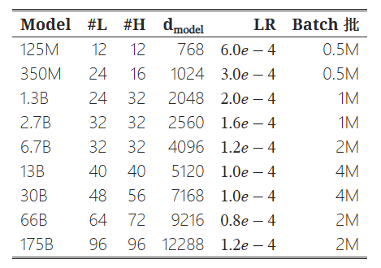
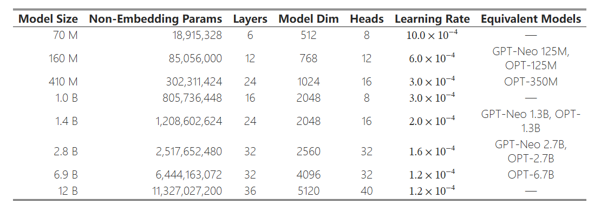

# 🎉**Awesome-SLM**🎉

## 🌱 How to Contribute
We are welcome contributions from researchers. For detailed guidelines on how to contribute, please see our [CONTRIBUTING.md](CONTRIBUTING.md) file.

## 📜 Contents
- [🎉**Awesome SLM**🎉](#Awesome-SLM)
  - [🌱 How to Contribute](#-how-to-contribute)
  - [📜 Contents](#-contents)
  - [👋 Introduction](#-introduction)
  - [🔥 Base Model](#-base-model)
  - [💪 Pretrain datasets](#-Pretrain-dataset)
  - [💡 SFT datasets](#-SFT-dataset)
  - [🔧 synthetic datasets](#-synthetic-dataset)
  - [📦 preference dataset](#-preference-dataset)
  - [🌈 benchmark](#-benchmark)
 
## 👋 Introduction

## 🔥 Base Model
1. OPT-series [paper] [code] [model]
  - release time: 2022/06
  - organzation: meta
  - model size: 125M, 350M, 1.3B, 2.7B, 6.7B, 13B, 30B, 66B, 175B
  1. 训练数据：该模型使用了广泛的训练数据集，包括RoBERTa使用的数据集、The Pile以及PushShift.io的Reddit数据，数据量为180B tokens。对数据进行了去重处理，这些数据主要是英语文本，使用GPT-2的BPE分词器。
  2. 训练策略：模型训练使用了AdamW优化器，学习率采用线性调度，从零逐步升至最大值，然后随着训练进程逐渐下降。此外，训练过程中采用了较大的batch size
  3. 注意力机制：仅解码器的预训练transformer模型，采用多头自注意力机制，使用交替dense and locally banded sparse attention
  4. 模型层数和Block类型：模型的架构和超参数主要遵循GPT-3的设计

2. Pythia [paper] [code] [model]
  - release time: 2023/06
  - organzation: meta
  - model size: 70M, 160M, 410M, 1.0B, 1.4B, 2.8B, 6.9B, 12B
  - 模型结构：
  1. 训练数据：训练数据使用的是Pile数据集，数据为全英文，经去重处理后数据量大小为 207B
  2. 训练策略：使用GPT-NeoX库进行训练，采用Adam优化器，并利用零冗余优化（ZeRO）和数据并行、张量并行的方法来优化性能。
  3. 注意力机制：采用多头自注意力机制，dense attention，使用旋转嵌入，在训练过程中使用Flash Attention技术来提高设备吞吐量
  4. 模型层数和Block类型：模型的架构和超参数主要遵循GPT-3的设计

3. phi-1 [paper] [code] [model]
  - release time: 2023/06
  - organzation: mircosoft
  - model size: 1.42B
  - 模型结构：
  1. 训练数据：  数据集处理方面比较有特色，提出了教科书级数据，包含从The Stack和StackOverflow中筛选出的子集（约6B tokens）、由GPT-3.5生成的Python教科书（少于1B的tokens）、约180M的Python练习和解决方案的tokens
  2. 训练策略：phi-1-base模型在CodeTextbook数据集（过滤后的代码语言数据集和合成教科书数据集）上进行预训练，使用AdamW优化器、线性预热线性衰减学习率调度、attention和残差dropout均为0.1，batch size为1024
  3. 注意力机制：使用了仅解码器transformer的多头注意力机制，并在预训练和微调过程中使用了flashattention来提高效率
  4. 模型层数和Block类型：
  模型包含24层，使用并行配置的 MHA 和 MLP 层，每个Block包括以下部分：
      隐藏层大小：2048
      注意力头数：32
      最大位置嵌入：2048
      位置嵌入类型：旋转位置嵌入（rotary）
      残差连接：gpt-j-residual

4. phi-1_5 [paper] [model]
  - release time: 2023/09
  - organzation: mircosoft
  - model size: 1.42B
  - 模型结构：
  1. 训练数据：  phi-1的训练数据（7B tokens）+新创建的合成“教科书”数据（约20B tokens），用于教授常识推理和世界通用知识（科学、日常活动、心智理论等）
  2. 训练策略：从随机初始化开始训练phi-1.5，使用常数学习率2e-4（无预热），权重衰减：0.1。Adam优化器，动量参数为0.9和0.98。混合精度训练使用fp16和DeepSpeed ZeRO Stage 2，批量大小2048。
  3. 注意力机制：使用了仅解码器transformer的多头注意力机制，并在预训练和微调过程中使用了flashattention来提高效率
  4. 模型层数和Block类型：（和phi-1相同）
  模型包含24层，使用并行配置的 MHA 和 MLP 层，每个Block包括以下部分：
      隐藏层大小：2048
      注意力头数：32
      注意力头维度：64
      最大位置嵌入：2048
      位置嵌入类型：旋转位置嵌入（rotary）
      残差连接：gpt-j-residual

5. phi-2 [paper][model]
  - release time: 2023/12
  - organzation: mircosoft
  - model size: 2.78B
  - 模型结构：
  1. 训练数据： 与phi-1.5相同，数据源基于phi-1.5，并增加了由各种NLP合成文本和过滤网站（出于安全和教育价值）组成的新数据源250B tokens，训练tokens为1.4T tokens
  2. 训练策略：没有详细明确
  3. 注意力机制：没有详细明确
  4. 模型层数和Block类型：没有详细明确

6. phi-3-series [paper] [model]
  - release time: 2024/04
  - organzation: mircosoft
  - model series: Phi-3-mini-4k-instruct, Phi-3-mini-128k-instruct
  - model size: 3.82B
  - 模型结构：
  1. 训练数据： 训练数据集是phi-2数据集的升级版本，包括经过严格过滤的公开可用的网页数据和合成数据，训练tokens为3.3T tokens
  2. 训练策略：
  预训练分为两个不连续且顺序进行的阶段：1.主要使用网络来源的数据，旨在教授模型通用知识和语言理解。2.合并了更多经过严格过滤的网络数据和一些合成数据，旨在教授模型逻辑推理和各种特殊技能
  后训练：包括监督微调（SFT）和直接偏好优化（DPO）两个阶段。SFT数据集覆盖多种领域的高质量数据，DPO数据集则用于调整模型行为
  3. 注意力机制：使用了仅解码器transformer的分组查询注意力机制，默认上下文长度为4K，使用LongRope技术扩展到128K，使用Flash Attention加速训练
  4. 模型层数和Block类型：（ Llama-2 类似的块结构）
  模型包含32层，每个Block包括以下部分：
      隐藏层大小：3072
      注意力头数：32
      注意力头维度：64
      最大位置嵌入：2048
      位置嵌入类型：旋转位置嵌入（rotary）
      残差连接：gpt-j-residual

7. Tinyllama [paper] [model]
  - release time: 2024/01
  - organzation: 新加坡科技与设计大学
  - model size: 1.1B
  - 模型结构：
  1. 训练数据： 训练数据由两部分组成： SlimPajama：这是一个高质量的语料库，专门用于训练大型语言模型。它由RedPajama衍生而来，并经过额外的清洗和去重过程。原始的RedPajama语料库包含超过1.2万亿tokens。经过过滤后，SlimPajama保留了原始tokens的50%；StarCoder训练数据集：这个数据集用于训练StarCoder，包含86种编程语言的数据，除了代码数据外，还包括GitHub问题和涉及自然语言的文本-代码对。为避免重复，SlimPajama中移除了GitHub子集，只从StarCoder训练数据集中采样代码相关数据.合并这两个数据集后，得到大约9500亿tokens进行预训练，总共处理了3万亿tokens
  2. 训练策略：Adamw优化器，基于lit-gpt构建框架。TinyLlama的预训练分为两个阶段： 
  基础预训练：使用SlimPajama数据训练1.5万亿tokens，主要发展模型的常识推理能力。
  持续预训练：结合SlimPajama数据和StarCoder、Proof Pile等代码和数学内容，以及Skypile的中文数据，分别针对一般应用、数学和编码任务以及中文处理进行持续预训练
  3. 注意力机制：使用分组查询注意力机制，使用旋转位置嵌入（RoPE）,使用Flash Attention2加速训练
  4. 模型层数和Block类型：模型共22层
  隐藏层大小：2048
  中间隐藏层大小：5632
  上下文长度：2048
  注意力头数：32
  词汇表大小：32000
  激活函数：使用SwiGLU，即Swish激活函数和门控线性单元（GLU）的结合
  预归一化和RMS归一化：在每个Transformer子层的输入进行归一化

8. MiniCPM-series [paper][code] [model]
  - release time: 2024/02
  - organzation: openbmb
  - model series: MiniCPM-1B-sft-bf16, MiniCPM-2B-sft-bf16, MiniCPM-2B-sft-fp32, MiniCPM-2B-128k, MiniCPM-MoE-8x2B
  - model size: 1.2B, 2.4B, 8X2.4B (excluding embeddings)

9. H2O-Danube-1.8B [paper] [code] [model]
  - release time: 2024/04
  - organzation: h2oai
  - model series: h2o-danube2-1.8b-base, h2o-danube2-1.8b-sft, h2o-danube2-1.8b-chat
  - model size: 1.8B

10. csg-wukong-series[model]
  - release time: 2024/04
  - organzation: opencsg
  - model series: csg-wukong-1B, csg-wukong-1B-VL, csg-wukong-1B-chat
  - model size: 1B

11. CT-LLM-Base[paper] [code] [model]
  - release time: 2024/04
  - organzation: Peking University
  - model series: CT-LLM-Base
  - model size: 2B

12. Qwen-series[paper] [code] [model]
  - release time: 2023/08
  - organzation: Alibaba Cloud
  - model series: Qwen-1.8B, Qwen-7B, Qwen-14B, and Qwen-72B, Qwen-1.8B-Chat, Qwen-7B-Chat, Qwen-14B-Chat, Qwen-72B-Chat
  - model size: 1.8B,7B,14B,72B

13. Qwen2-series[paper] [code] [model]
  - release time: 2024/06
  - organzation: Alibaba Cloud
  - model series: Qwen2-0.5B, Qwen2-1.5B, Qwen2-7B, Qwen2-57B-A14B, Qwen2-72B
  - model size: 0.5B,7B,A14B,72B

14. Gemma-series[paper] [code] [model]
  - release time: 2024/02
  - organzation: Google
  - model series: gemma-2b, gemma-2b-it, gemma-7b, gemma-7b-it, gemma-2-9b,gemma-2-9b-it,gemma-2-27b,gemma-2-27b-it
  - model size: 2B,7B,27B

15. OpenELM-series[paper] [code] [model]
  - release time: 2024/04
  - organzation: apple
  - model series: OpenELM-270M, OpenELM-450M, OpenELM-1.1B, OpenELM-3B,OpenELM-270M-Instruct,OpenELM-450M-Instruct,OpenELM-1.1B-Instruct,OpenELM-3B-Instruct
  - model size: 0.27B,0.45B,1.1B,3B

16. Sheared-LLaMA-series[paper] [code] [model]
  - release time: 2023/10
  - organzation: Princeton NLP group
  - model series:  Sheared-LLaMA-1.3B, Sheared-LLaMA-2.7B,Sheared-LLaMA-1.3B-Pruned, Sheared-LLaMA-2.7B-Pruned,Sheared-LLaMA-1.3B-ShareGPT, Sheared-LLaMA-2.7B-ShareGPT
  - model size: 1.3B,2.7B

17. SlimPajama-DC[paper] [code] [model]
  - release time: 2023/09
  - organzation: cerebras
  - model series:  SlimPajama-DC-1.3B
  - model size: 1.3B

18. RedPajama [code] [model]
  - release time: 2023/05
  - organzation: Together Computer.
  - model series: RedPajama-INCITE-Base-3B-v1, RedPajama-INCITE-Instruct-3B-v1,RedPajama-INCITE-Chat-3B-v1
  - model size: 1.3B

19. OLMo[paper] [code] [model]
  - release time: 2024/02
  - organzation: allenai
  - model series:  OLMo-1B,OLMo-7B,OLMo-7B-Twin-2T
  - model size: 1B,7B

20. Cerebras-GPT-series[paper] [model]
  - release time: 2023/04
  - organzation: cerebras
  - model series:  Cerebras-GPT-111M,Cerebras-GPT-256M,Cerebras-GPT-590M,Cerebras-GPT-11.3B,Cerebras-GPT-2.7B,Cerebras-GPT-6.7B,Cerebras-GPT-111M,Cerebras-GPT-13B
  - model size: 111M, 256M, 590M, 1.3B, 2.7B, 6.7B, 13B

- Qwen-series[[paper](https://arxiv.org/abs/2309.16609)] [[code](https://github.com/QwenLM/Qwen)] 
[[model](https://huggingface.co/Qwen)]
    - release time: 2023/08
    - organzation: Alibaba Cloud
    - model series: Qwen-1.8B, Qwen-7B, Qwen-14B, and Qwen-72B, Qwen-1.8B-Chat, Qwen-7B-Chat, Qwen-14B-Chat, Qwen-72B-Chat
    - model size: 1.8B,7B,14B,72B

- Qwen2-series[[paper](https://qwenlm.github.io/zh/blog/qwen2/)] [[code](https://github.com/QwenLM/Qwen2)] [[model](https://huggingface.co/Qwen)]
    - release time: 2024/06
    - organzation: Alibaba Cloud
    - model series: Qwen2-0.5B, Qwen2-1.5B, Qwen2-7B, Qwen2-57B-A14B, Qwen2-72B
    - model size: 0.5B,7B,A14B,72B

- Gemma-series[[paper](https://storage.googleapis.com/deepmind-media/gemma/gemma-report.pdf)] [[code](https://github.com/google-deepmind/gemma)] [[model](https://huggingface.co/google/gemma-2b)]
    - release time: 2024/02
    - organzation: Google
    - model series: gemma-2b, gemma-2b-it, gemma-7b, gemma-7b-it, gemma-2-9b,gemma-2-9b-it,gemma-2-27b,gemma-2-27b-it
    - model size: 2B,7B,27B

- OpenELM-series[[paper](https://arxiv.org/abs/2404.14619)] [[code](https://github.com/apple/corenet)] [[model](https://huggingface.co/collections/apple/openelm-instruct-models-6619ad295d7ae9f868b759c)]
    - release time: 2024/04
    - organzation: apple
    - model series: OpenELM-270M, OpenELM-450M, OpenELM-1.1B, OpenELM-3B,OpenELM-270M-Instruct,OpenELM-450M-Instruct,OpenELM-1.1B-Instruct,OpenELM-3B-Instruct
    - model size: 0.27B,0.45B,1.1B,3B

 - Sheared-LLaMA-series[[paper](https://arxiv.org/abs/2310.06694)] [[code](https://github.com/princeton-nlp/LLM-Shearing)] [[model](https://huggingface.co/princeton-nlp/Sheared-LLaMA-1.3B)]
    - release time: 2023/10
    - organzation: Princeton NLP group
    - model series:  Sheared-LLaMA-1.3B, Sheared-LLaMA-2.7B,Sheared-LLaMA-1.3B-Pruned, Sheared-LLaMA-2.7B-Pruned,Sheared-LLaMA-1.3B-ShareGPT, Sheared-LLaMA-2.7B-ShareGPT
    - model size: 1.3B,2.7B

## 💪 Pretrain Datasets
- SlimPajama-627B [[paper](https://www.cerebras.net/blog/slimpajama-a-627b-token-cleaned-and-deduplicated-version-of-redpajama)] [[code](https://github.com/Cerebras/modelzoo/tree/main/src/cerebras/modelzoo/data_preparation/nlp/slimpajama)] [[dataset](https://huggingface.co/datasets/cerebras/SlimPajama-627B)]
  - release time: 2023/06
  - dataset size: 895 GB
  - token size: 627B
  - language: Primarily English, with some non-English files in Wikipedia
  

- dolma [[paper](https://arxiv.org/abs/2402.00159)] [[code](https://github.com/allenai/dolma)] [[dataset](https://huggingface.co/datasets/allenai/dolma)]
  - release time: 2024/04
  - dataset size: 4.5TB
  - token size: 1.7T
  - language: Primarily English, with some non-English files in Wikipedia

- RedPajama-Data-1T [[paper](https://arxiv.org/pdf/1906.02285.pdf)] [[code](https://github.com/togethercomputer/RedPajama-Data)] [[dataset](https://huggingface.co/datasets/togethercomputer/RedPajama-Data-1T)]
  - release time: 2023/04
  - token size: 627B

- C4 [[paper](https://www.tensorflow.org/datasets/catalog/c4)] [[code](https://github.com/allenai/c4-documentation)] [[dataset](https://huggingface.co/datasets/c4)]
  - release time: 2022/01
  - dataset size: en: 305GB, en.noclean: 2.3TB, en.noblocklist: 380GB, realnewslike: 15GB, multilingual (mC4): 9.7TB (108 subsets, one per language)

## 💡 SFT Datasets
- ultrachat [[code](https://github.com/thunlp/UltraChat)] [[dataset](https://huggingface.co/datasets/stingning/ultrachat)]
  - release time: 2023/04
  - dataset size: 2.5GB
  - language: en

- ultrachat_200k [[code](https://github.com/thunlp/UltraChat)] [[dataset](https://huggingface.co/datasets/HuggingFaceH4/ultrachat_200k)]
  - release time: 2023/10
  - dataset size: 1.6GB
  - language: en

## 🔧 synthetic datasets
- cosmopedia [[code](https://github.com/thunlp/UltraChat)] [[dataset](https://huggingface.co/datasets/HuggingFaceTB/cosmopedia)]
  - release time: 2024/02
  - dataset size: 92.2GB
  - language: en

## 📦 preference dataset
- UltraFeedback [[code](https://github.com/thunlp/UltraChat)] [[dataset](https://huggingface.co/datasets/openbmb/UltraFeedback)]
  - release time: 2023/09
  - dataset size: 0.94GB
  - language: en

## 🌈 benchmark
